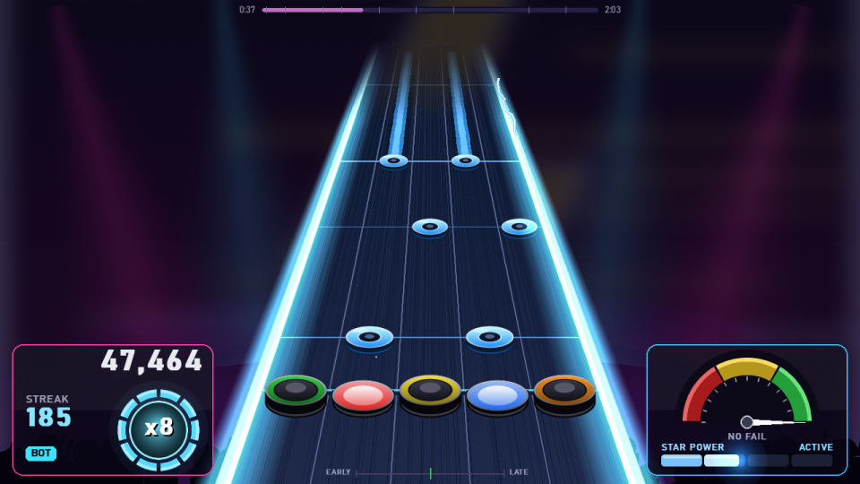

# RİFF — Guitar Hero tarzı 5 perdeli ritim oyunu

Guitar Hero / Clone Hero'nun gitar ve nota mekaniğinin birebir kopyası (Python 3.14 + pygame-ce).
Kaynak araştırma: `Levo-researches/` (LeventBic/Levo-Researches → `reports/oyun/2026-09-18-gitar-ritim-oyunu-*`).
**Proje belgesi (kaynaklar, sistemler, nasıl yapıldı): [docs/PROJE.md](docs/PROJE.md)** · Plan: [PLAN.md](PLAN.md) · Mimari: [docs/ARCHITECTURE.md](docs/ARCHITECTURE.md) · Kararlar: [docs/KARARLAR.md](docs/KARARLAR.md)



## İndir ve oyna (Windows)
1. [Releases](https://github.com/LeventBic/Guitar_Hero/releases/latest) sayfasından `RIFF-windows.zip`'i indir.
2. Zip'i bir klasöre çıkar, `RIFF\RIFF.exe`'yi çalıştır (kurulum gerekmez; klasörün tamamı birlikte kalmalı).
3. Kendi şarkını eklemek için MP3/OGG/FLAC dosyasını oyun penceresine sürükle (aşağıda: *Kendi şarkını ekle*).

## Kaynaktan çalıştırma
Python 3.14 (Windows) gerekir.
```powershell
git clone https://github.com/LeventBic/Guitar_Hero.git
cd Guitar_Hero
py -3.14 -m venv .venv
.\.venv\Scripts\python.exe -m pip install -r requirements.txt
.\.venv\Scripts\python.exe tools\make_demo_songs.py    # demo şarkılar -> Songs\ (~11 s)
.\.venv\Scripts\python.exe main.py
```
Kendi exe'ni üretmek: `powershell -ExecutionPolicy Bypass -File build.ps1 -Zip` → `dist\RIFF\RIFF.exe` + `dist\RIFF-windows.zip`.

## Oynamak
`RIFF.exe` (klasörün tamamı birlikte taşınmalı; `Songs\` exe'nin yanında).
Kendi şarkıların: Clone Hero formatındaki klasörleri (`notes.chart`/`notes.mid`, `song.ini`, `song.ogg`, `guitar.ogg`) `Songs\` içine at.

| Aksiyon | Klavye | Xbox 360 gitar |
|---|---|---|
| Perdeler (yeşil→turuncu) | 1 2 3 4 5 | A B Y X LB |
| Strum (vuruş) | Space / ↑ / ↓ | D-pad yukarı/aşağı |
| Açık nota | hiç perde basmadan Space | — |
| Star Power | H | Tilt / Back |
| Whammy | ; | Whammy çubuğu |
| Duraklat | Enter / Esc | Start |
| Tam ekran / debug | F11 / F3 | — |

Menüler: ok tuşları + Enter/Space/Esc veya GH usulü (yeşil = seç, kırmızı = geri, strum = gezin).
**Ayarlar** (dil, tuş atama, nota hızı, ses/görüntü offset, No Fail, tam ekran): ana menü → AYARLAR, şarkı listesinde **Tab**, oyunda Esc → AYARLAR. Tuş değiştirmek için satırda Enter'a basıp yeni tuşa bas.
**Dil:** Türkçe / English — Ayarlar'ın en üstündeki "Dil / Language" satırı (anında uygulanır, `settings.json`'a yazılır; ilk açılışta Windows arayüz dili Türkçe ise Türkçe).

## Kendi şarkını ekle
Herhangi bir şarkıyı (MP3, OGG, WAV, FLAC, OPUS) oyuna at, 4 zorluğun notaları **otomatik** üretilsin — internet ya da ek program gerekmez (analiz ve yapay zekâ modelleri exe'nin içinde, CPU'da çalışır).
- **Sürükle-bırak:** dosyaları (veya klasörleri, birden çok) oyun penceresine bırak — ana menü → **ŞARKI EKLE** ekranı birakma alanıdır, ama her menü ekranı kabul eder (oyun sırasında bırakılanlar şarkı bitince eklenir).
- **Klasör:** dosyaları `Songs\_Import` içine kopyala; oyun açılırken / şarkı listesine girerken kendiliğinden eklenir (başarılı olanlar klasörden silinir, hatalılar kalır). ŞARKI EKLE → **KLASÖRÜ AÇ** / **ŞİMDİ EKLE**.
- Ekranda ilerleme çubuğu ve dosya başına sonuç görünür; bitince **HEMEN OYNA** ya da **ŞARKI LİSTESİ**. Eklenen şarkılar listede **OTO** rozetiyle görünür; **R** = notaları yeniden üret (onaylı, eski chart `notes.chart.bak`), **I** = şarkı ekle ekranı.
- Ad/sanatçı/albüm/yıl/tür ve kapak dosyanın etiketlerinden (ID3, Vorbis/Opus, FLAC, WAV INFO) okunur; etiket yoksa dosya adı `Sanatçı - Şarkı.mp3` biçiminde olmalı. Kapak yoksa kapak çizilir.
- **Gitar kalibrasyonu (yapay zekâ):** şarkıdaki gitar Demucs (htdemucs_6s) ile ayrıştırılır, notaları basic-pitch ile çıkarılır; chart gitarın çaldığını izler (gitarın sustuğu intro/efekt/vokal bölümlerine nota konmaz, power chord'lar akor, uzun notalar sustain). Klasöre `guitar.ogg` (ayrılan gitar — kaçırınca kısılır) + `song.ogg` (geri kalan) yazılır, listede **GİTAR** rozeti. Süre: şarkı dakikası başına ~15–20 sn (7,5 dk Metallica "One" ~2 dk); Esc ile iptal.
- Distorsiyonlu sololar (ritim gitarıyla aynı kanalda kalan lead) ayrıca tespit edilir: o bölümde chug yerine lead çizgisi çalınır ve bölüm **solo** olarak işaretlenir (solo yüzdesi / bonusu).
- Belirgin gitar yoksa (ya da Ayarlar → *Gitar algılama* kapalıysa, şarkı 12 dk'dan uzunsa) eski yönteme döner: notalar **tüm miksin** ritmini ve melodisini izler (**OTO** rozeti, ayrı gitar kanalı yok).
- Öneri: OGG/MP3, 44,1 kHz, şarkının tamamı (1–10 dk; sınır 10 sn–15 dk).
- **Elle yapılmış chart (birebir senkron):** otomatik chart yaklaşık olur; topluluğun elle yaptığı chart'lar [Chorus Encore](https://www.enchor.us)'da. `tools\chorus_fetch.py "Sanatçı Şarkı"` en iyi eşleşmeyi (resmi oyunlardan çıkarılmış chart'lar hariç) indirip `Songs\` altına açar; paket chart'ın kendi sesini içerir. `--list` sonuçları gösterir, `--from-file liste.txt` satır satır toplu indirir, `--songs <klasör>` hedef. Sadece Expert'i olan chart'lara Hard/Medium/Easy, Expert notalarından seçilerek eklenir (senkron aynı kalır; mevcut klasör için `--fill <klasör>`, oyuna sürüklenen Clone Hero klasörlerinde de otomatik). Kişisel kullanım içindir.
- Ölçüm: `tools\benchmark_autochart.py` — demo şarkılarda el yapımı chart'a karşı miks yöntemi tempo hatası %0, Expert onset F1 0.81–0.91; gerçek gitar kanalıyla F1 0.97–1.00. `--synthetic`: distorsiyonlu sentetik rock miksi, `--real dosya.mp3`: gerçek şarkı raporu.

## Mekanik (Clone Hero / YARG değerleri)
±70 ms vuruş penceresi · tek notada anchoring, akorda tam eşleşme · doğal HOPO (`.chart` 65/192·res, `.mid` res/3+1) ve force/tap/açık notalar · strum leniency 50/25 ms, HOPO leniency 80 ms, anti-ghosting · sustain 25 puan/beat (akor çarpmaz), whammy ile SP dolumu · nota 50 puan, çarpan 1x→4x (her 10 nota), SP ×2 (8x) · SP cümlesi %25, ≥%50 aktivasyon, tam bar 8 ölçü · rock metre (No Fail varsayılan açık) · yıldızlar (0.06…1.15 × taban skor) · miss/overstrum'da gitar stem'i kısılır.

## Geliştirme
```powershell
.\.venv\Scripts\python.exe main.py                     # oyunu kaynaktan çalıştır
.\.venv\Scripts\python.exe -m pytest tests -q           # 193 test
.\.venv\Scripts\python.exe main.py --smoke              # tüm şarkı × zorluk bot ile headless
.\.venv\Scripts\python.exe main.py --song "Songs\RIFF Demo Band - Voltage Run" --diff expert --autoplay
.\.venv\Scripts\python.exe tools\make_demo_songs.py     # demo şarkıları yeniden üret (~11 s)
.\.venv\Scripts\python.exe main.py --import sarki.mp3 --smoke   # headless: şarkı ekle + bot ile oynat
.\.venv\Scripts\python.exe tools\benchmark_autochart.py # otomatik chart ölçümü (demo miksler vs el yapımı chart)
powershell -ExecutionPolicy Bypass -File build.ps1      # test + ikon + PyInstaller -> dist\RIFF\RIFF.exe
```
Diğer bayraklar: `--screenshot out.png --at 30`, `--screenshot-menu out.png`, `--no-bot`, `--quit-after N`, `--fps N`.
Çökme olursa `riff_crash.log` exe'nin yanına yazılır.
