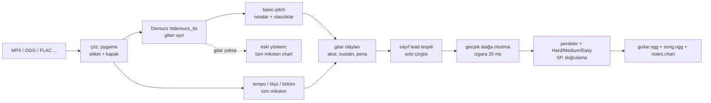

# Guitar Hero (eski adı RİFF) — Proje belgesi

Bu belge Guitar Hero'in ne olduğunu, nasıl yapıldığını, hangi sistemleri kullandığını ve içerikleri (modeller, chart'lar,
klipler) **nereden aldığımızı** anlatır. Kurulum ve oynanış için [README](../README.md), modül sözleşmeleri için
[ARCHITECTURE](ARCHITECTURE.md), tek tek kararlar ve gerekçeleri için [KARARLAR](KARARLAR.md), yapılış sırası için
[PLAN](../PLAN.md).

---

## 1. Özet

Guitar Hero, Guitar Hero / Clone Hero'nun **5 perdeli gitar mekaniğini** birebir uygulayan bir Windows ritim oyunudur.

| | |
|---|---|
| Dil / çalışma zamanı | Python 3.14 |
| Oyun motoru | kendi motorumuz + pygame-ce (SDL2) |
| Dağıtım | PyInstaller → `GuitarHero.exe` (onedir), GitHub Releases'ta `GuitarHero-windows.zip` |
| Şarkı biçimi | Clone Hero uyumlu klasör: `notes.chart` / `notes.mid` + `song.ini` + ses stem'leri (+ `video.*`) |
| Kendi şarkını ekleme | MP3/OGG/WAV/FLAC/OPUS sürükle-bırak → yapay zekâ ile otomatik chart |
| Elle yapılmış chart | Chorus Encore'dan indirme aracı (`tools/chorus_fetch.py`) |
| Test | pytest, 193 test; bot ile headless "smoke" koşuları |
| Kod | ~14.400 satır uygulama (`gh/`), ~2.600 satır araç (`tools/`), ~2.900 satır test |

---

## 2. Kullanılan sistemler ve kütüphaneler

| Sistem | Sürüm | Ne için | Lisans |
|---|---|---|---|
| [Python](https://www.python.org) | 3.14 | her şey | PSF |
| [pygame-ce](https://github.com/pygame-community/pygame-ce) (SDL2, SDL_mixer) | 2.5.8 | pencere, çizim, girdi, ses çalma / çözme (MP3, OGG, OPUS, FLAC, WAV) | LGPL-2.1 |
| [NumPy](https://numpy.org) | 2.5 | sinyal işleme (STFT, onset, tempo, perde), otomatik chart | BSD-3 |
| [ONNX Runtime](https://onnxruntime.ai) | 1.30 | yapay zekâ modellerini CPU'da çalıştırma | MIT |
| [PyAV](https://github.com/PyAV-Org/PyAV) (FFmpeg) | 18.1 | arka plan videosu çözme (mp4, webm, ...) | BSD-3 / LGPL |
| [python-soundfile](https://github.com/bastibe/python-soundfile) (libsndfile) | 0.14 | OGG Vorbis stem yazma, etiket okuma | BSD-3 / LGPL |
| [PyInstaller](https://pyinstaller.org) | 6.22 | tek klasörlük `GuitarHero.exe` | GPL-2 + bootloader istisnası |
| [pytest](https://pytest.org) | 9.1 | testler | MIT |
| [GitHub CLI](https://cli.github.com) | — | depo, release | — |

Bilinçli olarak **kullanılmayanlar:** torch, librosa, scipy, mido (oyun içinde). Ağır bağımlılık yerine kendi
numpy kodumuz ya da ONNX'e çevrilmiş modeller var; `torch` yalnız modelleri bir kez ONNX'e çevirmek için
(`tools/export_models.py`, geliştirme makinesinde) gerekti.

---

## 3. Mimari

İki katman (ayrıntı: [ARCHITECTURE](ARCHITECTURE.md)):

```
gh/
├── engine/      oyun kuralları (pygame YOK): GuitarEngine, pencere/leniency, HOPO/tap/açık, sustain, whammy,
│                Star Power, çarpan, rock metre, puan/yıldız, autoplay botu
├── chart/       .chart / .mid / song.ini okuyucular, HOPO çözücü, şarkı tarayıcı, .sng paket okuyucu
├── timing.py    tempo haritası (tick <-> saniye)          models.py  veri sınıfları
├── autochart/   otomatik chart (yalnız numpy): analiz, tempo, bölümler, charter, gitardan chart, zorluk üretimi
├── ai/          yapay zekâ (onnxruntime): Demucs ayrıştırma, basic-pitch transkripsiyon, boru hattı
├── importer.py  şarkı ekleme: çözme, etiketler, kapak, stem yazma, yeniden chart
├── video.py     arka plan videosu (PyAV, ayrı iş parçacığı)
├── audio.py     Conductor: ses saati, stem'ler, kaçırınca gitarın kısılması, offset'ler
├── render/      perspektif otoban, gem'ler, HUD, metal paneller, sahne / video arka planları
└── scenes/      başlık, şarkı listesi, zorluk, oyun, duraklatma, sonuç, ayarlar, kalibrasyon, içe aktarma
```

- `engine`, `chart`, `timing`, `models`, `autochart`, `ai` **pygame import etmez**: saf, test edilebilir, ileride
  başka bir motora (ör. C#) taşınabilir.
- Zaman: `SongTime` (yargı) = ses konumu − chart offset − ses gecikmesi; `VisualTime` (çizim) = SongTime + görüntü
  gecikmesi. Şarkının kendi videosu **ses konumunu** izler (chart offset / `song.ini delay` dahil).
- Mekanik değerleri Clone Hero / YARG varsayılanları: ±70 ms pencere, strum 50/25 ms, HOPO 80 ms, çarpan 1x→4x,
  Star Power %25 / %50 / 8 ölçü, whammy.

---

## 4. Ne yaptık — özellikler ve nasıl çalıştıkları

### 4.1 Oyun
- 5 perde + strum (klavye 1–5 + Space, Xbox 360 gitar kontrolcüsü), HOPO / tap / açık nota, sustain + whammy,
  Star Power, solo bölümleri (yüzde + bonus), rock metre (No Fail varsayılan), yıldızlar, sonuç ekranı.
- Kalibrasyon (ses / görüntü gecikmesi), ayarlar (tuş atama, nota hızı, otoban uzunluğu, ses, video, dil).
- Türkçe / English.
- 3 özgün demo şarkı (`tools/make_demo_songs.py` ile tamamen sentezlenmiş; telif yok).

### 4.2 Kendi şarkını ekleme: otomatik chart
Dosya oyun penceresine sürüklenir (ya da `Songs\_Import`'a kopyalanır).



1. **Gitar ayrıştırma:** Meta'nın **Demucs v4 `htdemucs_6s`** modeli (6 kaynak: davul, bas, diğer, vokal, gitar,
   piyano). Sinir ağı ONNX'te; STFT/iSTFT ve parçalı overlap-add numpy'da, Demucs'un kurallarıyla birebir
   (`gh/ai/spec.py`, `gh/ai/demucs.py`). 7,5 dakikalık şarkı CPU'da ~2 dk.
2. **Nota çıkarma:** Spotify'ın **basic-pitch** modeli; son işleme numpy'a taşındı (`gh/ai/basic_pitch.py`).
3. **Tempo / ölçü / bölümler:** kendi analizimiz (`gh/autochart/`: çok bantlı spektral akı, otokorelasyon + önsel
   ile tempo, yerel tempolu dinamik programlama ile vuruş takibi, kroma öz-benzerliği ile bölümler).
4. **Gitardan chart** (`gh/autochart/guitar.py`): gitarın sustuğu yere nota konmaz; power chord → 2'li akor;
   cümle cümle "perde merdiveni" (aynı perde = aynı tuş, yukarı = yukarı); uzun notalar sustain; hızlı pena
   notaları strum, legato HOPO.
5. **Zayıf lead (distorsiyonlu solo) tespiti:** iki gitar tek kanala ayrıldığında basic-pitch soloyu eşik altında
   bırakıp ritim gitarını (chug) yazıyordu. Yüksek perdede notayla / harmonikle açıklanamayan, gerçek bir atakla
   çakışan onset tepeleri yoğunsa bölge solo sayılır; orada ritim yerine lead çizgisi çalınır ve chart'a
   `E solo` işareti konur.
6. **Senkron:** her nota gitar kanalındaki en yakın **gerçek atağa** (spektral akı tepesi, ≤50 ms) taşınır;
   atağı olmayan zayıf notalar atılır; ızgaraya yalnız ≤20 ms yakınsa oturtulur; çift kayıtlı gitarların
   L/R flamları tek notaya iner.
7. **Zorluklar:** Hard / Medium (4 perde) / Easy (3 perde) Expert'ten seçilerek üretilir; bot ile her zorlukta
   "full combo, 0 boşa vuruş" doğrulaması yapılır.
8. Gitar bulunamazsa (ya da ayar kapalıysa) eski yönteme döner: tüm miksin ritmi / melodisi.

**Ölçümler:** demo şarkılarda gerçek gitar kanalıyla onset F1 0.97–1.00; Metallica "One"da notaların gerçek
gitar vuruşuna ≤20 ms yakınlığı %49 → %71 (senkron düzeltmesi). Otomatik chart yine de **yaklaşıktır**;
birebir senkron için elle yapılmış chart gerekir (4.3).

### 4.3 Elle yapılmış chart'lar: Chorus Encore
- Guitar Hero ve Clone Hero dünyasında chart'lar **elle** yapılır (tempo haritası + MIDI notaları). Topluluğun
  chart'ları [Chorus Encore](https://www.enchor.us) arama motorunda.
- `tools/chorus_fetch.py`: arar (`api.enchor.us/search`, `/search/advanced`), en iyi eşleşmeyi seçer (resmi oyun
  chart'ları, canlı / cover sürümler geride), paketi (`files.enchor.us/<md5>.sng`) indirip `Songs\` altına açar.
  `--list`, `--md5 a,b,c`, `--from-file liste.txt`, `--no-video`, `--allow-official`, `--fill <klasör>`.
- `.sng` paket biçimi (`gh/chart/sng.py`): başlık + metadata (→ `song.ini`) + dosya dizini + XOR maskeli veri.
- Yalnız Expert'i olan chart'lara Hard / Medium / Easy, Expert notalarından seçilerek eklenir
  (`gh/autochart/fill.py`); zamanlar değişmediği için senkron elle yapılmış chart kadar iyi kalır.
- Clone Hero'nun zengin metin etiketleri (`<color=...>`, `<b>`) ad / sanatçı / charter'dan temizlenir.

### 4.4 Arka plan videosu
- Şarkı klasöründe `video.mp4 / .webm / ...` varsa o çalar (ses konumuna kilitli, `video_start_time` desteği);
  yoksa 15 hazır gitarist klibinden biri (şarkı adına göre sabit) döngüyle döner. Menülerde de karartılmış klip.
- Çözme ve ölçekleme ayrı iş parçacığında (PyAV / FFmpeg); oyun ~237 FPS, kare başına ~2 ms.
- Ayarlar → *Arka plan videosu* ile kapatılabilir.

### 4.5 Arayüz
Ad ve logo: oyunun adı **Guitar Hero** (eski adı RİFF; marka notu için KARARLAR D18), logo `assets/logo.png`
(kullanıcının verdiği görsel; `tools/make_logo.py` koyu arka planı saydamlaştırır, metal harflerin hatlarını opak tutar).
Guitar Hero tarzı rock sahnesi: gül ağacı sap dokusu, gümüş teller ve perde çizgileri, krom raylar, vidalı metal
paneller, alev turuncu / kehribar / bronz palet, alev parlamalı logo. Arayüz öğeleri kodla (prosedürel)
çizilir; hazır görsel olarak yalnız ikon ve şarkıların kapakları var. Ekran görüntüleri `docs/screenshots/`.

### 4.6 Şarkı kütüphanesi ve setlist'ler
`Songs\` altındaki her üst klasör bir **setlist**'tir (örn. `Songs\Guitar Hero III - Legends of Rock\...`).
Şarkı listesi setlist'lere göre gruplanır; kökteki şarkılar "Şarkılarım" olarak en başta; sol / sağ ok
setlist'ler arasında atlar. Bilinen oyunlar çıkış yılına göre sıralanır.

### 4.7 Oyun içi setlist indirici
- Ana menü → **SETLIST İNDİR** (şarkı listesinde **D**): Guitar Hero serisinin 16 ana setlist'i (GH 2005 … GH Live 2015,
  875 şarkı, ~10.8 GB) ve "Tüm setlist'ler" satırı; her satırda kurulu / toplam şarkı ve inecek boyut.
- Liste `assets/setlists.json`'da (**yalnız meta veri**, 110 KB): oyun, yıl, klasör; şarkı başına Chorus md5, sanatçı, ad,
  süre, paket boyutu. Şarkılar oyuncunun isteğiyle Chorus Encore'dan (`files.enchor.us/<md5>_novideo.sng`) oyuncunun kendi
  `Songs\<oyun>` klasörüne iner.
- `gh/chorus.py` (indirme çekirdeği; `tools/chorus_fetch.py` de kullanır): paket geçici `.<md5>.part` klasörüne açılır,
  eksik zorluklar doldurulur, `song.ini`'ye `chorus_md5` yazılır, tek adımda yerine taşınır → iptal / hata yarım klasör
  bırakmaz; kurulu md5'ler atlanır (kaldığı yerden devam).
- `gh/setlists.py` `Downloader`: arka plan iş parçacığı, şarkı başına 3 deneme, şarkılar arası kısa bekleme (servisi
  yormamak için), hız / kalan süre, Esc ile iptal; disk alanı önceden kontrol edilir.
- Headless: `main.py --download-setlist <id|all> [--limit N] [--songs-dir D]`.

---

## 5. Nereden aldık — kaynaklar ve lisanslar

| İçerik | Kaynak | Lisans / durum | Repoda mı? |
|---|---|---|---|
| Mekanik değerleri, mimari araştırması | Levo-Researches raporları (`LeventBic/Levo-Researches`, `reports/oyun/2026-09-18-gitar-ritim-oyunu-*`); Clone Hero / YARG davranışı | kendi araştırmamız | hayır (ayrı depo) |
| Gitar ayrıştırma modeli `htdemucs_6s.onnx` | [facebookresearch/demucs](https://github.com/facebookresearch/demucs) (Meta), `tools/export_models.py` ile ONNX'e | MIT | evet (`assets/models`) |
| Nota çıkarma modeli `basic_pitch_nmp.onnx` | [spotify/basic-pitch](https://github.com/spotify/basic-pitch) | Apache-2.0 | evet (`assets/models`) |
| Arka plan klipleri (15 adet) | [Pexels](https://www.pexels.com) — yazarlar ve sayfalar `assets/videos/CREDITS.md` | [Pexels License](https://www.pexels.com/license/) (ücretsiz, yazılım içinde dağıtım serbest) | evet (`assets/videos`) |
| Demo şarkılar | kendi sentezimiz (`tools/make_demo_songs.py`) | bizim | üretilir (`Songs\` git dışı) |
| Chorus Encore API bilgisi | [Geomitron/Bridge](https://github.com/Geomitron/Bridge) kaynağı okunarak (kod kopyalanmadı) | GPL-3.0 (yalnız referans) | — |
| `.sng` biçimi | [mdsitton/SngFileFormat](https://github.com/mdsitton/SngFileFormat) | belge | — |
| Topluluk chart'ları (ör. Metallica "One" — DeltaOm3ga) | Chorus Encore | chart'ı yapanın; ses hak sahibinin | **hayır**, yalnız kullanıcının bilgisayarında |
| Resmi oyun chart'ları (Guitar Hero serisi, GH Live) | Chorus Encore (oyunlardan çıkarılmış) | Activision / Harmonix vb. telifli | **hayır**, yalnız kullanıcının bilgisayarında |
| Setlist listesi `assets/setlists.json` (meta veri) | Chorus Encore arama / gelişmiş arama API'si (charter + oyun paketi) | yalnız ad / sanatçı / md5 / boyut; kullanıcı kararıyla repoda (KARARLAR D19) | evet |
| Otomatik chart araştırması | [CloneCharter](https://github.com/TheJorseman/CloneCharter), [audio2chart](https://www.arxiv.org/abs/2511.03337), [OCTAVE](https://octavestudio.tools/guide/auto-chart) | referans | — |

Paketlenen kütüphanelerin lisans metinleri: [THIRD_PARTY_NOTICES.md](../THIRD_PARTY_NOTICES.md) (exe klasörüne de
kopyalanır).

**Telif ilkesi:** Repoya ve GitHub sürümlerine yalnız bizim kodumuz, açık lisanslı modeller / klipler ve özgün
demo şarkılar girer. Chorus'tan indirilen her şey (ses + chart + klip) `Songs\` altında kalır; `Songs/` git dışıdır
ve `build.ps1 -Zip` dağıtım paketine yalnız demo şarkıları koyar. Setlist indirici yalnız şarkı listesini taşır; dosyaları
her oyuncu kendi bilgisayarına Chorus'tan indirir.

---

## 6. Nasıl yapılır — kurulum, geliştirme, dağıtım

### Kaynaktan çalıştırma
```powershell
git clone https://github.com/LeventBic/Guitar_Hero.git
cd Guitar_Hero
py -3.14 -m venv .venv
.\.venv\Scripts\python.exe -m pip install -r requirements.txt
.\.venv\Scripts\python.exe tools\make_demo_songs.py
.\.venv\Scripts\python.exe main.py
```

### Test
```powershell
.\.venv\Scripts\python.exe -m pytest tests -q            # 193 test (~75 s)
.\.venv\Scripts\python.exe main.py --smoke               # tüm şarkı x zorluk, bot, headless
.\.venv\Scripts\python.exe main.py --song "<klasör>" --screenshot out.png --at 30
.\.venv\Scripts\python.exe tools\benchmark_autochart.py  # otomatik chart ölçümü (--synthetic, --real f.mp3)
```

### Exe ve dağıtım
```powershell
powershell -ExecutionPolicy Bypass -File build.ps1 -Zip  # test + ikon + PyInstaller + zip
gh release create vX.Y.Z dist\GuitarHero-windows.zip --title "Guitar Hero vX.Y.Z" --notes "..."
```
- `dist\GuitarHero\GuitarHero.exe` (~170 MB klasör: onnxruntime, FFmpeg, modeller, klipler), `dist\GuitarHero-windows.zip` (~100 MB,
  yalnız demo şarkılar).
- Proje OneDrive'da: `build.ps1` bazen `build\GuitarHero\base_library.zip` bulunamadı hatası verir (senkron kilidi) —
  tekrar çalıştırmak yeter.

### Şarkı ekleme araçları
```powershell
.\.venv\Scripts\python.exe tools\chorus_fetch.py "Metallica One" --list
.\.venv\Scripts\python.exe tools\chorus_fetch.py "Metallica One" --songs C:\Users\<ben>\GuitarHero\Songs
.\.venv\Scripts\python.exe tools\chorus_fetch.py --from-file liste.txt --no-video --songs <klasör>
.\.venv\Scripts\python.exe tools\chorus_fetch.py --fill "<şarkı klasörü>"       # eksik zorlukları üret
.\.venv\Scripts\python.exe main.py --import sarki.mp3 --smoke                    # otomatik chart + bot
.\.venv\Scripts\python.exe main.py --download-setlist gh3 --limit 5            # oyun içi indiricinin headless hâli
```

### Modelleri yeniden üretme (yalnız gerekirse)
`tools/export_models.py` torch + demucs + basic-pitch paketleriyle ONNX dosyalarını üretir (fp16 ağırlık);
oyun ve testler için gerekmez, dosyalar repoda.

---

## 7. Bu makinedeki kurulum (kişisel, repoda değil)

| | |
|---|---|
| Oyun | `C:\Users\bicak\GuitarHero\GuitarHero.exe` (OneDrive dışında; Masaüstünde `Guitar Hero` kısayolu) |
| `Songs\` (kök, "Şarkılarım") | 3 demo + Metallica "One" (DeltaOm3ga topluluk chart'ı, Hard/Medium/Easy üretildi) |
| `Songs\Guitar Hero Live\` | 42 şarkı (R U Mine? klipli, diğerleri klipsiz) |
| `Songs\Guitar Hero ...\` | Guitar Hero, II, Encore 80s, III, On Tour (3), Aerosmith, World Tour, Metallica, Smash Hits, 5, Band Hero, Van Halen, Warriors of Rock — ana disk listeleri, 833 şarkı (~10 GB; co-op kopyaları hariç; DJ Hero'larda gitar chart'ı yok) |
| Kaynak kod | `C:\Users\bicak\OneDrive\Belgeler\Software\guitarhero` → GitHub `LeventBic/Guitar_Hero` (gizli) |

---

## 8. Yapılış kronolojisi (2026-09-23)

| Aşama | Commit'ler |
|---|---|
| İskelet, okuyucular, motor, demo içerik, ön yüz, exe | `c3c3f13` … `7be1d1d` |
| Tuşlar 1–5 + Space, duraklatma / ayarlar | `f3418ef` |
| Otomatik chart (miks), sürükle-bırak, TR/EN | `f4b109e` |
| Yapay zekâ ile gitar kalibrasyonu (Demucs + basic-pitch) | `ec5748b`, `e4f328d` |
| Distorsiyonlu solo tespiti + solo işaretleri | `f26a25a`, `f5c28a5`, `ff1647e` |
| Senkron: gerçek atağa oturtma | `ccc55fb` |
| Chorus Encore + `.sng` + zorluk üretimi | `cd6314b`, `4c871e2`, `622a966` |
| Paylaşıma hazırlık (requirements, lisanslar, zip, GitHub) | `6618005`, `02f5340` |
| Arka plan videosu + Pexels klipleri | `afc37ba`, `8c46aaa`, `73b268c` |
| Guitar Hero tarzı arayüz | `b62a428` |
| Setlist'lere göre şarkı listesi | `50e2460` |
| Belgeler, tuş atama / F3 düzeltmeleri, v1.1.0 | `4646a6d`, `3fc3284`, `ca4f145` |
| Ad "Guitar Hero" + logo (2026-09-24) | `02cec36` |
| Oyun içi setlist indirici, v1.2.0 | (bu sürüm) |

---

## 9. Bilinen sınırlar ve sonraki adımlar
- Otomatik chart yaklaşıktır (One'da notaların ~%30'u gerçek vuruştan >20 ms uzak); gerçek şarkılar için
  Chorus'taki elle yapılmış chart tercih edilmeli.
- Gitar çok zayıf ayrışırsa (ör. demo şarkılardaki sentez gitar) otomatik chart seyrek kalabilir.
- Otomatik bölüm adları miks analizinden gelir ("Verse 1 … N").
- Gerçek bir gitar kontrolcüsüyle donanım testi yapılmadı.
- Resmi oyun setlist'leri telifli; depo herkese açılırsa şikâyetle kaldırılabilir (KARARLAR D18, D19).
